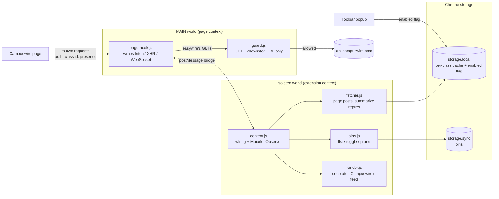

<div align="center">

# easywire

**See what's actually new on Campuswire.**

Latest-activity times, reply counts, a "Recent activity" sort, and personal pins for the Campuswire class feed. Read-only, with no dependencies and no build step.

[](manifest.json)
[](src)
[](tests)
[](#architecture)

[Features](#features) · [How it stays read-only](#how-it-stays-read-only) · [Architecture](#architecture) · [Getting Started](#getting-started)

</div>

---

## Why easywire?

Campuswire's feed shows when a post was *created*, not when someone last replied to it. A question from last week that just got a TA answer sits buried with a stale "7 days" timestamp and no hint that anything changed. The post's `updatedAt` doesn't move on new comments, and `answersCount` only ever reads 0 or 1, so the page itself has no way to tell you.

easywire fetches the replies for every post in the class, works out each post's real latest activity, and writes it back into the feed you already use.

## Features

### Feed
- **Latest-activity times** —> each post's clock shows the newest reply time, not the original post time, using the same moment.js wording Campuswire uses (`12 hours`, `a day`, `3 days`)
- **Reply counts** —> every feed item shows its total replies at every depth, right next to the time
- **Recent activity sort** —> a new option in Campuswire's own category dropdown that re-orders the whole class feed by latest activity
- **Native look** —> sorted and pinned cards reuse Campuswire's layout and post-type icons (pen for notes, check for resolved questions)
- **Avatars and presence** —> pinned and sorted cards show the author's avatar with a live online dot, plus Campuswire's unread marker
- **Anonymous icons** —> anonymous posts get Campuswire's own anonymous avatar instead of the blank spot the page leaves, on native cards too

### Pins
- **Personal pins** —> pin any post; pinned posts show up in a collapsible "My pins" section at the top of the feed
- **Synced** —> pins live in `chrome.storage.sync`, per class, and follow you across browsers
- **Self-cleaning** —> pins for deleted posts are pruned, but only after a *complete* refresh, so a failed request never wipes them

### Well-behaved
- **Cached per class** —> posts and reply summaries are stored locally, so revisits render instantly and only refresh when needed
- **Throttled** —> at most 3 concurrent requests and one refresh per class per minute; the throttle survives reloads
- **Backs off** —> a 401 or 429 from Campuswire pauses all fetching for 10 minutes
- **On/off switch** —> the toolbar popup turns easywire off instantly, cancels any in-flight crawl, and removes all of its UI

## How it stays read-only

easywire never posts, replies, edits, reacts, marks posts viewed, or changes settings. This is enforced in code:

- Only `src/page-hook.js` makes network requests, and every one passes through `EasywireGuard.isAllowedRequest` first.
- The guard accepts `GET` requests only, and only for two URL shapes: the post list (`/v1/group/{id}/posts?number=N[&before=…]`) and a post's comments (`/v1/group/{id}/posts/{id}/comments`). Anything else is refused, including `POST`, `/viewed`, `..` segments, and look-alike hosts.
- Fetching `/comments` doesn't mark a post viewed. That only happens when you open the post yourself.
- Online status is read passively from Campuswire's own `/v1/users` responses and presence WebSocket frames. easywire never requests it.
- Your Campuswire auth header is read from the page's own requests and never leaves the page's JavaScript context. The extension's isolated scripts never see it.

## Architecture



### Main technologies

| Layer | Technology |
|---|---|
| Extension | Chrome Manifest V3, MAIN-world + isolated-world content scripts (Chrome 111+) |
| Language | Plain JavaScript, no build step, no runtime or dev dependencies |
| Storage | `chrome.storage.local` (+ `unlimitedStorage`) for caches, `chrome.storage.sync` for pins |
| Tests | Node's built-in test runner (`node --test`) |

### Repository layout

```text
.
├── manifest.json          # MV3 manifest, matches https://campuswire.com/* only
├── src/
│   ├── guard.js           #   Read-only URL rules (MAIN world, pure)
│   ├── page-hook.js       #   Wraps fetch/XHR/WebSocket, captures auth + presence, serves allowed GETs
│   ├── activity.js        #   summarize, sortByActivity, formatRelative (pure)
│   ├── pins.js            #   Serialized pin list/toggle/prune over storage
│   ├── fetcher.js         #   Paging, reply summaries, cache, throttle, pause
│   ├── render.js          #   Feed decorations, My pins, sorted list, dropdown item
│   ├── content.js         #   Wires everything together
│   ├── styles.css
│   └── popup/             #   On/off toggle
└── tests/                 # One test file per pure module + renderer
```

## Getting Started

### Prerequisites

- A Chromium browser (Chrome, Edge, Brave), version 111+
- Node.js 18+ (only needed to run the tests)

### Install

1. Clone the repo:
   ```bash
   git clone https://github.com/gRain-is-grainy/easywire.git
   ```
2. Open `chrome://extensions` and turn on **Developer mode**.
3. Click **Load unpacked** and select the `easywire` folder.
4. Open any class feed on [campuswire.com](https://campuswire.com). Activity times and reply counts fill in as the first crawl finishes.

To pick up code changes, hit the reload button on the extension card and refresh Campuswire.

### Tests

```bash
node --test                  # runs everything in tests/
```

---

<div align="center">

If easywire helped you catch a TA answer on a week-old question, star the repo.

</div>
